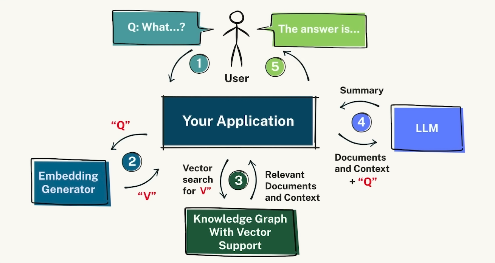
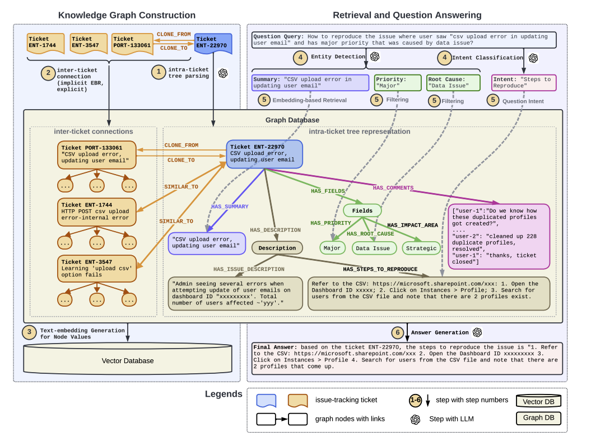

# Knowledge-graph-ai (WIP)

A central hub for company knowledge.A network of interconnected data sources delivering organizational wisdom using RAG with llm.

## Graph A-RAG System Design

The core design pattern is very simple, yet powerful. For the initial phase, I've broken the problem into two main steps:


### Knowledge Graph Creation

1. **ETL (Extract, Transform, Load) Pipeline**

   - ETL from multiple and diverse sources.
   - ETL pipeline should flow to building the ontology layer.

2. **Ontology and Knowledge Graph**
   - Decide on an ontology format.
   - To begin, we can auto-create the knowledge graph using their tool: [Neo4j Labs Graph Builder](https://llm-graph-builder.neo4jlabs.com/). For visualization, use: [Neo4j Bloom](https://neo4j.com/product/bloom/).
   - Human validation might be needed.
   - (Optional) You can use the same AI to control graph creation from the data.

### Data Retrieval from a Vector Database Using the Knowledge Graph to Prompt the AI

1. **Vector Search and Contextual Retrieval**
   - Perform a vector search to identify an initial set of nodes.
   - Traverse the graph around these nodes to add context.
   - (Optional) Rank the results using the graph and pass the top-k documents to the LLM.

### Step Zero

- Use the same AI to create the ontology and validate it by running a functional script. This ensures that the AI becomes the control agent for the design.

### Design Diagram Reference

Reference from RAG with Knowledge Graphs for Customer Service Question Answering Paper:


```
​​                        		  +--------------------+
                                |   	Raw Data 	 |
                                +--------------------+
                                            |
                                            V
                                +---------------------+
                                |  Data Ingestion &   |
                                |    Preprocessing    |
                                +---------------------+
                                            |
                                            V
                     +---------------------------------+
                     |  Intra-Issue Parsing (Rule & LLM)|
                     +---------------------------------+
                                            |
                                            V
                    +-----------------------------------------+
                    |   Knowledge Graph Construction          |
                    |   - Intra-ticket trees (nodes, edges)   |
                    |   - Inter-ticket connections            |
                    +-----------------------------------------+
                                            |
                                            V


                         +-------------------------+
                         |  Graph Database (Neo4j) |
                         +-------------------------+
                                            |
                                            V
                          +-----------------------+
                          |  Node Embedding Gen   |
                          |   (BERT/E5, etc.)     |
                          +-----------------------+
                                            |
                                            V
                            +---------------------+
                            | Vector DB (Qdrant)  |
                            +---------------------+
                                            |
                                            V
                                +------------------+
                                |   Query Engine   |
                                |                  |
                                |  - Entity & Intent|
                                |    Parsing (LLM)  |
                                |  - Similarity Search|
                                +------------------+
                                            |
                                            V
                                +---------------------+
                                | Subgraph Extraction |
                                |    (LLM + Cypher)   |
                                +---------------------+
                                            |
                                            V
                                +---------------------+
                                | Answer Generation   |
                                |      (LLM)          |
                                +---------------------+
                                            |
                                            V
                                +---------------------+
                                |  Response to User   |
                                +---------------------+
```
